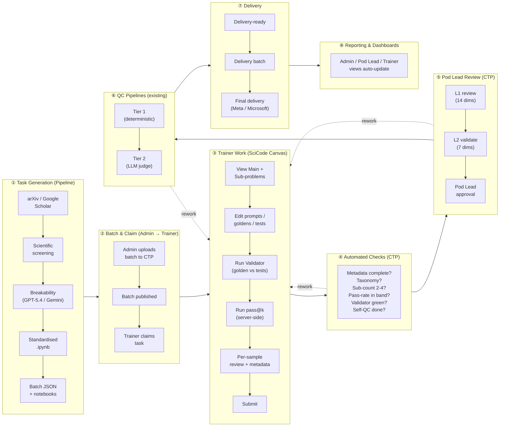
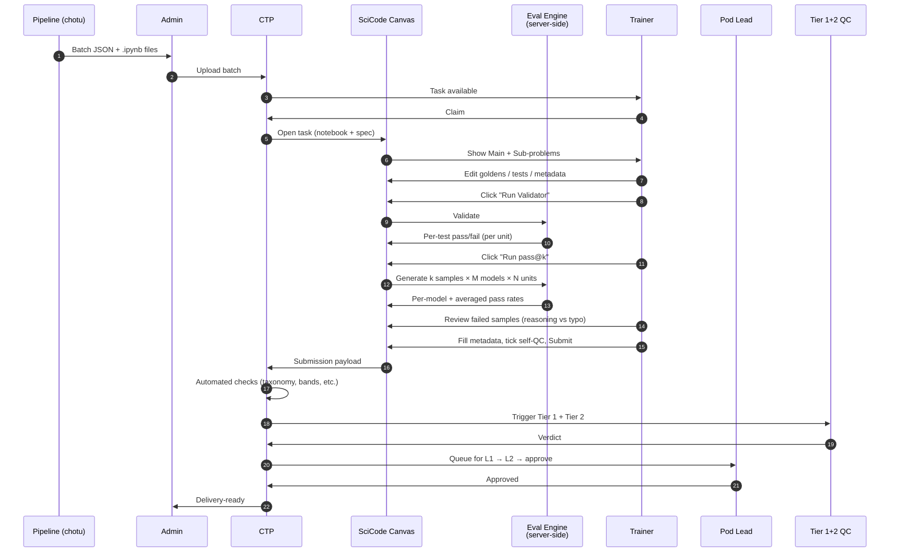
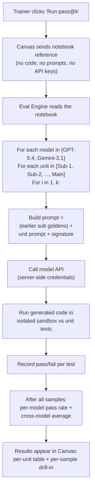

# SciCode Unified Workflow — One Portal for SFT, RLHF, Review, QC, Delivery

| Audience | SciCode pipeline owners, Pod Leads, Admins, Trainers |
| -------- | ---------------------------------------------------- |
| Status   | Proposal, ready for review |
| Owner    | Vivek Vashistha |
| Updated  | 2026-06-18 |
| Companion | Detailed RFC: [`docs/rfc/0001-scicode-canvas.md`](rfc/0001-scicode-canvas.md) |

> **One-line summary.** Keep your existing task-generation pipeline. Replace the trainer's "Labeling Tool + Colab + Chrome Validator + RLHF Playground + Google Sheets + QC Gatekeeper" mess with a single workspace called **SciCode Canvas** running on the **Central Task Platform (CTP)**, which also handles claim, review, QC, payment-relevant signals, and delivery.

---

## 1. Why this proposal

The "Optimizing the SciCode Project Operational Workflow" doc lists 9 pain points — manual handoffs, duplicated metadata, weak visibility, inconsistent pass@k tracking, dependency on Google Sheets, Pod Lead → delivery delays, payment ↔ quality disconnect.

The root cause is the same in every case: **the trainer's work is spread across 6+ tools** that don't talk to each other.

This proposal collapses those 6 tools into **one Canvas** plugged into one platform.

---

## 2. What changes (and what stays the same)

| What you have today | What changes | Why |
|---|---|---|
| **Task-generation pipeline** (`Scicode-Trainers-chotu`, arXiv → `.ipynb`) | **Stays exactly as-is.** Adds one small post-step that emits a CTP-ready batch JSON. | Preserves all your work. |
| `.ipynb` notebook format (Metadata → Title → Sub-problems → Main) | **Stays.** Canvas reads the same notebook structure. | Pipeline output stays canonical. |
| **Labeling Tool** (SFT project) | **Replaced** by CTP claim/submit + Canvas. | Single source of truth for task state. |
| **Google Colab** (trainer edits notebook here) | **Stays as primary editor in v1.** Canvas adds a "Sync from Colab" button. v2 may move edits in-canvas. | Don't disrupt trainer habit on day 1. |
| **Chrome Validator plugin** (golden vs tests) | **Replaced** by a "Run Validator" button in Canvas. Server runs the tests. | No browser plugin to install. |
| **RLHF Project + 8× GPT-5.4 instances + Pass Rate Evaluator Colab** | **Replaced** by a "Run pass@k" button in Canvas. Server runs all k samples × all reference models × all sub-problems + main, returns a pass-rate table. | Today's "RLHF" is empirical pass@k scoring, not preference labelling — naming it RLHF was always misleading. |
| **QC Gatekeeper (Gemini App + manual prompt)** | **Replaced** by a self-QC checklist in Canvas + the existing Tier 1/Tier 2 unified QC pipeline auto-triggered on submit. | No more separate Gemini App tab. |
| **Google Sheets** (master sheet, pass-rate sheet, issue logs) | **Replaced** by CTP dashboards (Admin / Pod Lead / Trainer). | Dashboards drive from real data, not manual entry. |
| **Tier 1 + Tier 2 QC pipeline** (`scicode-qc-unified-pipeline`) | **Stays.** Wired as an automatic post-submit step in CTP. | Reuses your existing checks. |
| **L1 (14 dims) and L2 (7 dims) review rubrics** | **Stay.** Configured inside CTP's reviewer UI; Pod Leads see them on the same task they reviewed. | Same rubrics, less context-switching. |
| **Two payment models** (per-hour, per-approved-task) | **Stay.** CTP tracks approved-task signal and time-on-task automatically. | Removes manual payment reconciliation. |

---

## 3. The unified flow (8 stages)

This mirrors the layout of the "Optimised Portal Workflow — SciCode" diagram in the optimization doc.



**Reading guide:** the dashed arrows are rework loops. Any failure pushes the task back to the trainer with the exact reasons attached — no Google Sheet, no Slack thread, no manual reassignment.

---

## 4. How a single task moves end-to-end



A whole task lives in one URL. The trainer never copies anything between tools. The Pod Lead sees the trainer's work, the validator output, the pass@k samples, and the metadata on one screen.

---

## 5. The bit people will ask about: how does pass@k run?

This is the question every Pod Lead will ask, so spelling it out:



**Three things worth knowing here:**

### 5.1 Sub-problem dependency rule
When a sub-problem depends on an earlier one, we feed the **gold-standard solution** of the earlier sub-problem into the prompt — never a model-generated answer. This is straight from the Trainer Guidelines:

> "When sub-problem N depends on sub-problem N-1, use the gold-standard solution code from N-1 as the prior-step context. This prevents error accumulation from invalidating the difficulty signal of sub-problem N."

The same applies to the Main problem — its prompt is `(all sub goldens) + main prompt`. There is no UX for "trainer picks which model output to chain into main." Prompt assembly is fixed and deterministic so the difficulty signal stays clean.

### 5.2 Cross-model averaging
Per the guidelines, difficulty = **average pass@k across the reference models**, not per-model. The cross-validation rule "use pass@6 / 2" lives in the engine. Pod Leads see both the per-model rates (for evidence) and the averaged value (which the gate checks).

### 5.3 What the trainer does after results
For each *failed* sample, the trainer marks it `accept` (failure was a real reasoning error → counts as model-breaking) or `reject` (failure was a typo / syntax / missing import → flag for revision). This is **not** RLHF preference labelling. It's evidence for L1 rubric dim #4 "Model Failure Reasons."

---

## 6. Stage-by-stage: what each persona sees

| Stage | Admin | Pod Lead | Trainer | Pipeline owner |
|---|---|---|---|---|
| **① Generation** | Reviews batch before publishing | — | — | **Owns this stage; pipeline unchanged** |
| **② Batch + claim** | Publishes batch; monitors claim rate | — | Claims a task in one click | — |
| **③ Trainer work** | Live activity feed | Sees draft as it evolves | Edits + runs Validator + runs pass@k + submits | — |
| **④ Auto checks** | Failure reasons surfaced in dashboard | Sees which gate blocked | Sees inline reasons; fixes; resubmits | — |
| **⑤ Pod Lead review** | Approval rate, reviewer load | **Owns L1 + L2 rubric** | Sees rework feedback inline | — |
| **⑥ QC pipelines** | Cost + verdict mix | Tier 1/2 verdicts visible on the task | Sees Tier 1/2 reasons on rework | — |
| **⑦ Delivery** | One-click release; AGI-OS mirror automatic | — | — | — |
| **⑧ Reporting** | Trainer perf, rework, throughput, $/task | Reviewer queue + scoring trend | Personal metrics + paid count | Pipeline → batch → completion funnel |

---

## 7. What the SciCode pipeline owner is asked to do

The pipeline change is **one small post-step**: emit a JSON file alongside the existing `.ipynb` outputs, in this shape, so CTP can ingest a batch in one upload:

```json
[
  {
    "external_id": "scicode_2026_06_18_001",
    "payload": {
      "version": 1,
      "problem_id": "...",
      "title": "...",
      "paper_ref": "https://arxiv.org/abs/...",
      "draft_taxonomy": { "domain": "Physics", "subdomain": "Quantum Mechanics" },
      "subproblems": [
        { "label": "Sub-problem 1", "prompt": "...", "draft_signature": "..." }
      ],
      "notebook": {
        "colab_url": "https://colab.research.google.com/drive/...",
        "media_id": "media_xxx"
      },
      "source": { "pipeline_run_id": "...", "generated_at": "..." }
    }
  }
]
```

Notebooks themselves are uploaded ahead of time via CTP's media service (a small helper script will be provided). The pipeline does not need to know anything about CTP internals — it produces files; CTP ingests them.

**Nothing else changes inside the pipeline.** Same arXiv fetcher, same scientific screening, same standardisation, same `.ipynb` schema.

---

## 8. Frequently asked

**Q: Will the new "Eval Engine" replace the Tier 1 / Tier 2 unified QC pipeline?**
No. Tier 1/2 stays where it is and continues to run as the post-submit final QC. The Eval Engine handles **trainer-time** Validator + pass@k (the parts that today are split across Chrome Validator and the RLHF Project). The two are complementary; one possible later optimization is for Tier 1 to call the Eval Engine for re-validation, but that's deferred.

**Q: Will trainers lose their Colab notebooks?**
No. Colab stays as the primary code editor in v1. Canvas adds a "Sync from Colab" button so the version of record always matches what the trainer saw last. Moving code edits inside Canvas is a v2 conversation, not a v1 ask.

**Q: Will pass@k cost more than today?**
Same model calls, just orchestrated by us instead of by the trainer running 8 RLHF instances by hand. Two cost reductions: (1) automatic caching when a trainer re-clicks "Run pass@k" without changing the notebook, (2) project-level rate limits and budget caps that don't exist today.

**Q: Are sub-problems separate tasks in CTP?**
No. **One CTP task = one paper = main + 2–4 sub-problems**, just like today's `.ipynb`. Sub-problems are execution units inside the task. Treating them as separate tasks would break L1/L2 review (which grades logical decomposition across the whole datapoint) and the per-paper delivery model.

**Q: What about the "RLHF" project — does that go away?**
Yes. The current "RLHF" project is a workaround to run pass@8 — its function is replaced by a button in Canvas. There is no preference-labelling RLHF in SciCode today, despite the project name.

**Q: What about per-client differences (Meta vs Microsoft)?**
Project-level config: `k`, allowed models, pass-rate bands, and the QC client are settings, not code. Same Canvas serves both.

**Q: How does Pod Lead review get faster?**
The Pod Lead opens one task and sees: trainer edits, validator output, pass@k samples (per-model + averaged), trainer's per-sample notes, metadata, self-QC checklist, and any Tier 1/2 verdicts — all on one screen. No tab-switching across 6 tools. L1 14-dim and L2 7-dim rubrics are inline.

**Q: When does this start shipping?**
Phased. The first deliverable is end-to-end happy path on a small pilot batch: Pipeline → Seed → Claim → Edit → Validator → pass@k → Submit → L1/L2 → Delivery. See the detailed RFC §7 for the phase plan.

---

## 9. Open questions for SciCode owners

These are the few things we'd like Ajay / Pod Leads to confirm so we lock the spec:

1. **Pass-rate band source of truth** — Trainer Guidelines say "Main 0–34%, Sub 0–100%." Trainers Guide HTML "Mandatory Checks" tab says "Main 0–40%, Sub 10–75%." Which one is the gate?
2. **Cross-model gate metric** — confirm we should use the **average** across `gpt-5.4-xhigh` and `gemini-3.1-high` (per the "pass@6 / 2" rule), not per-model gates.
3. **Per-client tracking** — single CTP project with client config, or one project per client (Meta / Microsoft)? Single project is simpler; two projects gives cleaner reporting.
4. **In-canvas code editing in v1** — current proposal is "code edits in Colab, markdown / metadata in Canvas." Comfortable, or do you want full code editing inside Canvas from day 1?
5. **Tier 2 auto-approve** — if Tier 1 + Tier 2 both pass, should the task auto-approve and skip L1, or always go through human L1 first?

---

## 10. Where to read more

- **Detailed engineering RFC:** [`docs/rfc/0001-scicode-canvas.md`](rfc/0001-scicode-canvas.md) — full spec, gates, payload schema, Eval Engine HTTP contract, build phases, risks.
- **Source documents we drew from:**
  - `docs/Optimizing - Scicode Project Over flow.docx` — current pain points + proposed flow
  - `docs/SciCode_Trainer_Guidelines.docx` — L1/L2 rubrics, taxonomy, pass-rate rules, sub-problem dependency rule
  - `docs/Trainers Guide.html` — current SFT + RLHF + Validator + Gatekeeper procedure
